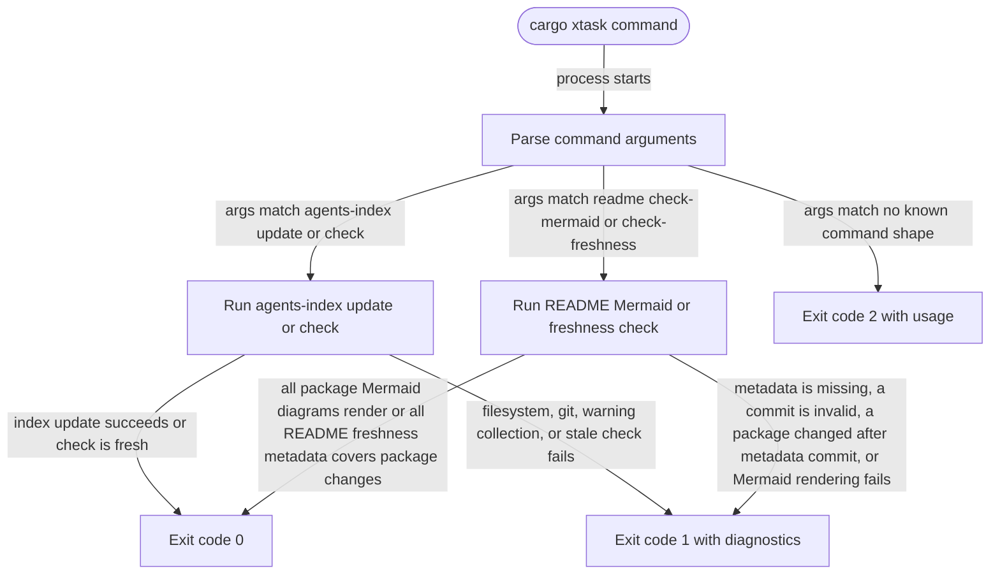

# xtask

<!-- selvedge-package-readme
package: xtask
freshness_commit: 592f95539c225023a2f2d66f8096a3f85ac304ee
-->

`xtask` contains repository-local automation that should stay out of production crates.

## Commands

- `cargo xtask agents-index update` regenerates the AGENTS.md project index.
- `cargo xtask agents-index check` checks that the AGENTS.md project index is current.
- `cargo xtask readme check-mermaid` renders every package README Mermaid fence.
- `cargo xtask readme check-freshness` checks package README freshness metadata against package-directory changes since the recorded commit, excluding the README file itself.

## Package State Machine

The diagram records the package-level observable states and transition paths. Each edge label names the concrete condition checked at this package boundary.

